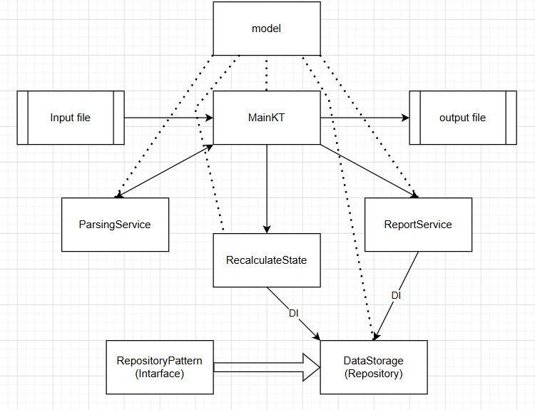

# Inventory Balance Calculator

Консольное приложение на Kotlin для расчёта остатков товаров по операциям поступления и продажи с учётом ранга товаров (лексикографический порядок).

**Запуск**:

  1)клонирование репозитория
  
  2)запуск через среду разработки(рекомендую IntellijIdea) или командно:
  ./gradlew run --args="interactionFiles/input.csv interactionFiles/output.csv"

Если не указывать аргументы, программа использует пути по умолчанию:

  interactionFiles/input.csv — входной файл
  
  interactionFiles/output.csv — выходной файл

**Формат вывода**: строки вида "group_id;product_id;quantity"

**Архитектура**: создал проект с соблюдением чистой архитектуры и принципов SOLID:

DataStorage — in-memory репозиторий (хранит данные в HashMap + TreeMap).

ParsingService — парсит CSV-строки в объекты Operation.

RecalculateState — бизнес-логика: применяет операции, рассчитывает остатки с учётом ранга.

ReportService — формирует выходной CSV-файл.

**Схема архитектуры**:

**Тесты**: добавил по 5 тестов для: хранилища данных, службы изменения хранилища и службы парсинга.

*Размышления и принятые архитектурные решения*:  

После размышлений требуется ли настроить полноценное спринг приложение решил, что это оверкил.

Сначала хотел сделать 2 вида запроса: по редактированию и получению, но перечитав условие понял что сохранять нет необходимости(т.к. на выходе мы получаем результат сразу после операции).

Если количество товаров == 0 то группу можно удалить, нет смысла хранить.

Т.к. не сказано к какому ключу товара добавлять долг, принял решение оставлять его на элемент с самым "высоким" ключом.

**Важно:** заметил нехватку перераспределения (если в группе будет отрицательное значение количества товара и при этом добавят товар с другим айди оптимально нужно перераспределить их количества(с возможным удалением пустого товара), но в ТЗ этого нет).

**Примеры использования**:

In:
1;14;5
2;33;3
1;12;8
1;6
1;112;3
3;4;4
2;5
1;5

Out:
1;112;3
1;12;2
2;33;-2
3;4;4
